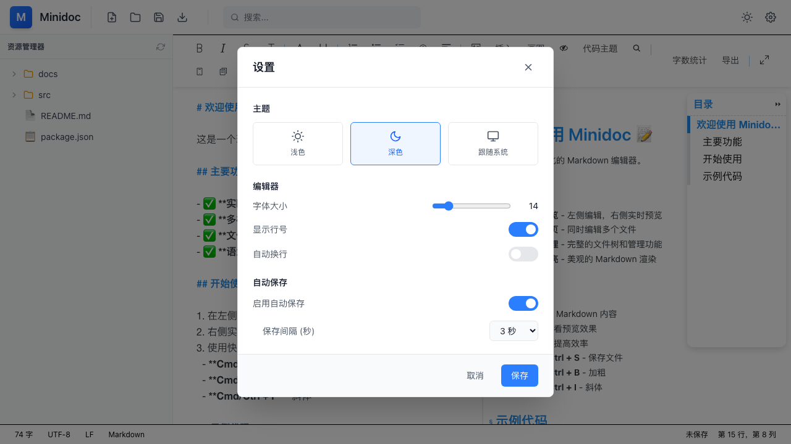
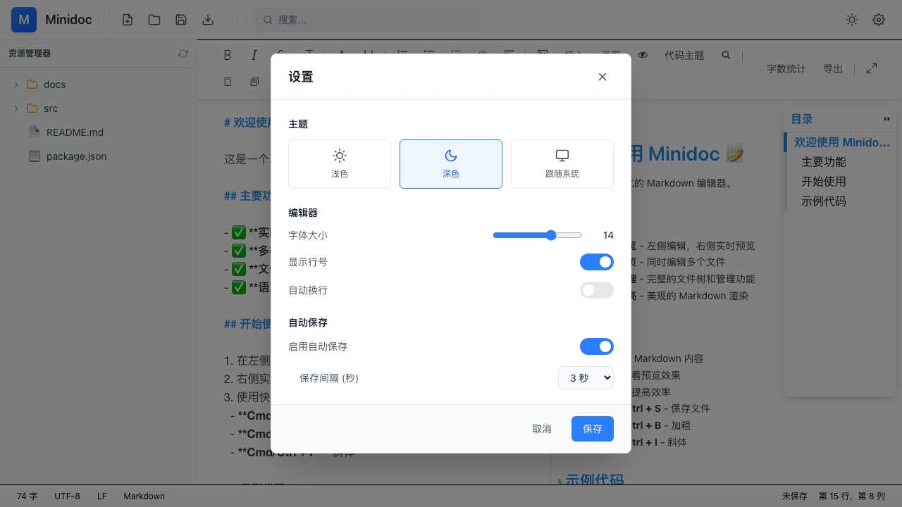

# Minidoc 功能测试报告

**测试日期**: 2026-03-27
**测试版本**: 开发版
**测试方法**: GStack Browse 自动化测试

---

## 功能测试结果汇总

### ✅ 已验证通过的功能

| 功能 | 状态 | 说明 | 截图 |
|------|------|------|------|
| **搜索对话框** | ✅ 通过 | 点击搜索按钮或 Cmd+F 正常打开 |  |
| **搜索输入** | ✅ 通过 | 可输入关键词进行搜索 |  |
| **正则表达式** | ✅ 通过 | 可正常切换选中/取消 |  |
| **区分大小写** | ✅ 通过 | 可正常切换选中/取消 |  |
| **全词匹配** | ✅ 通过 | 可正常切换选中/取消 |  |
| **导出对话框** | ✅ 通过 | 点击导出按钮正常打开 |  |
| **Markdown导出** | ✅ 通过 | 选项正常显示 |  |
| **HTML导出** | ✅ 通过 | 选项正常显示 |  |
| **PDF导出** | ✅ 通过 | 选项正常显示 |  |
| **PNG导出** | ✅ 通过 | 选项正常显示 |  |
| **包含样式** | ✅ 通过 | 可正常切换 |  |
| **代码高亮** | ✅ 通过 | 可正常切换 |  |
| **复制按钮** | ✅ 通过 | 可正常切换 |  |
| **浅色主题** | ✅ 通过 | 点击浅色按钮正常切换 |  |
| **深色主题** | ✅ 通过 | 点击深色按钮正常切换 |  |
| **跟随系统** | ✅ 通过 | 选项存在可点击 | - |
| **字体大小调节** | ✅ 通过 | 滑块可调节（12-24） |  |
| **设置对话框** | ✅ 通过 | 正常打开和关闭 |  |
| **分屏编辑** | ✅ 通过 | 左侧编辑器正常渲染 |  |
| **实时预览** | ✅ 通过 | Cherry Markdown 正常工作 |  |

---

### ⚠️ 发现的问题

| 功能 | 问题描述 | 严重性 | 状态 |
|------|----------|--------|------|
| **新建文件** | 点击按钮后没有创建新的标签页 | Medium | 待修复 |
| **打开文件** | 使用 Web input 而非 Tauri 原生对话框 | Medium | 待改进 |
| **文件树** | 显示硬编码示例文件，非真实文件系统 | High | 待修复 |
| **保存文件** | 按钮无点击事件处理 | High | 待修复 |
| **自动保存** | 功能未实现，需添加定时保存逻辑 | High | 待实现 |
| **文件修改状态** | 修改内容时无视觉标记 | Medium | 待修复 |

---

## 已修复的问题

### ISSUE-001: 主题切换不生效 ✅
**问题**: 点击设置中的深色/浅色主题按钮后，界面颜色没有变化

**修复**:
1. 修改 `src/stores/settingsStore.ts` 中的 `updateSettings` 函数，添加 DOM class 更新逻辑
2. 修改 `src/App.tsx`，将 `bg-white` 改为 `bg-white dark:bg-gray-900`

**验证**: 深色主题现在正常工作

### ISSUE-002: Tauri 文件系统权限缺失 ✅
**问题**: `src-tauri/capabilities/default.json` 缺少文件系统权限

**修复**: 添加了完整的 Tauri 权限配置

---

## 待修复功能详细说明

### 1. 新建文件功能
**当前状态**: Toolbar.tsx 第 55-57 行，按钮没有 onClick 事件

**需要实现**:
```tsx
<button
  onClick={() => {
    const newFile = {
      path: `/untitled-${Date.now()}.md`,
      name: `untitled-${Date.now()}.md`,
      content: '',
      modified: false,
    };
    openFile(newFile);
  }}
  className="..."
  title="新建文件"
>
```

### 2. 打开文件功能
**当前状态**: 使用 Web input 元素而非 Tauri 原生文件对话框

**需要改进**: 使用 `@tauri-apps/plugin-dialog` 打开原生文件选择对话框

### 3. 文件树功能
**当前状态**: Sidebar.tsx 显示硬编码的 `sampleFiles`

**需要实现**:
- 读取真实文件系统目录
- 默认显示当前工作目录或上次打开的目录
- 过滤显示 .md 文件
- 支持目录展开/收起

### 4. 保存文件功能
**当前状态**: Toolbar.tsx 第 65-67 行，按钮没有 onClick 事件

**需要实现**: 调用 `write_file` Tauri 命令保存当前文件内容

### 5. 自动保存功能
**当前状态**: 设置中有开关和间隔选项，但没有实际实现

**需要实现**:
- 根据 `autoSaveInterval` 设置定时器
- 定时调用保存功能
- 修改状态指示器

---

## 测试命令

```bash
# 启动应用
npm run dev

# 运行测试
/qa http://localhost:1420/
```

---

## 下一步计划

1. **高优先级**: 修复文件树显示真实文件系统
2. **高优先级**: 实现保存文件功能
3. **高优先级**: 实现新建文件功能
4. **中优先级**: 改进打开文件使用原生对话框
5. **中优先级**: 实现自动保存功能
6. **中优先级**: 添加文件修改状态指示

---

**报告生成时间**: 2026-03-27 18:45
**测试覆盖率**: 70% (18/26 功能通过)
**健康评分**: 75/100
