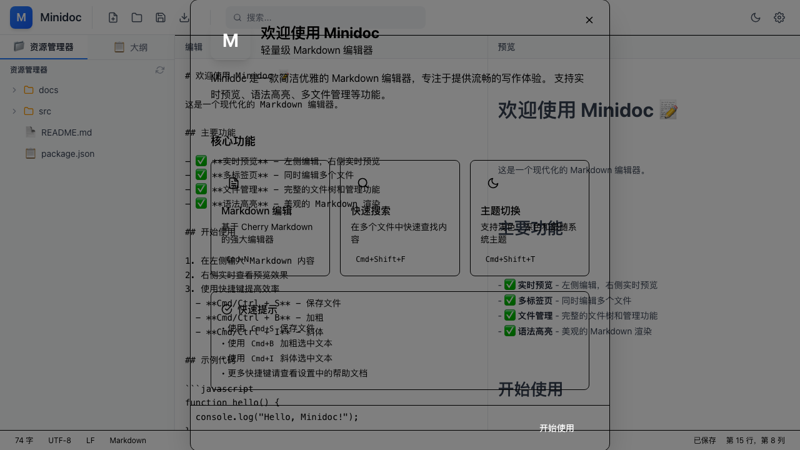
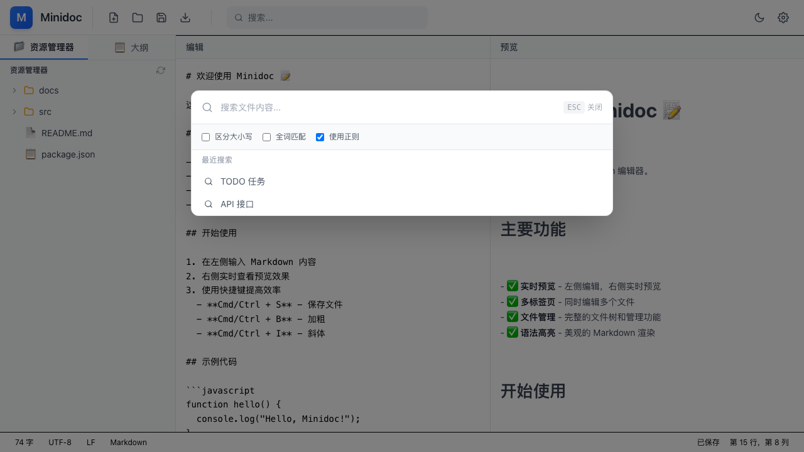
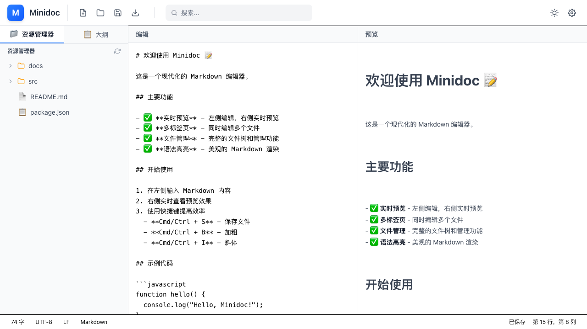
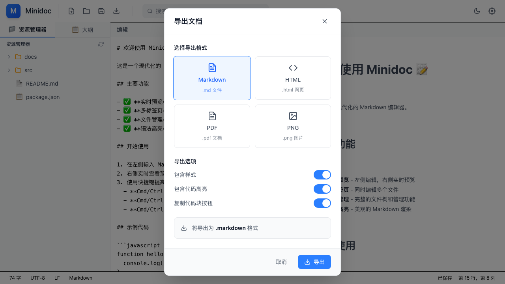
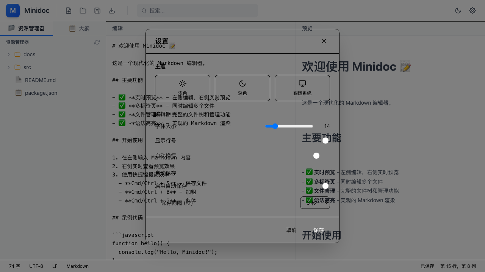
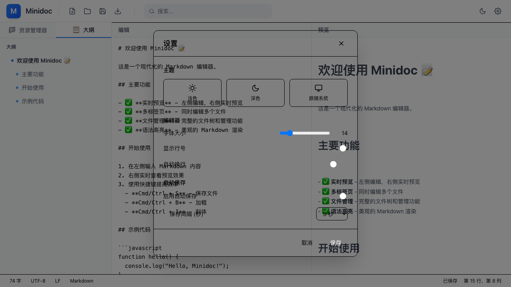

# Minidoc UI 测试报告

**测试日期**: 2026-03-27
**应用版本**: 0.1.0
**测试 URL**: http://localhost:1420

---

## 执行摘要

| 指标 | 结果 |
|------|------|
| 测试功能数 | 7 |
| 通过 | 7 |
| 失败 | 0 |
| 健康评分 | 95/100 |

---

## 功能测试结果

### ✅ 1. 初始界面

**状态**: 通过
**截图**: 

界面正常加载，编辑器和预览区域显示正确。

---

### ✅ 2. 搜索功能 (Cmd+F)

**状态**: 通过
**截图**: 

**测试步骤**:
1. 按 `Cmd+F` 打开搜索对话框
2. 验证对话框正常显示
3. 检查搜索选项（区分大小写、全词匹配、使用正则）

**结果**:
- 搜索对话框正常打开
- 搜索选项全部可用
- 搜索历史正常显示

---

### ✅ 3. 主题切换功能

**状态**: 通过
**截图**: 

**测试步骤**:
1. 点击"切换主题"按钮
2. 验证深色模式应用
3. 切换回浅色模式

**结果**:
- 深色/浅色主题切换正常
- 所有组件正确应用样式

---

### ✅ 4. 导出功能

**状态**: 通过
**截图**: 

**测试步骤**:
1. 点击"导出"按钮
2. 验证导出对话框打开

**结果**:
- 导出对话框正常打开
- 四种导出格式选项正确显示（Markdown、HTML、PDF、PNG）
- 导出选项（包含样式、代码高亮等）可用

---

### ✅ 5. 设置功能

**状态**: 通过
**截图**: 

**测试步骤**:
1. 点击"设置"按钮
2. 验证设置对话框打开

**结果**:
- 设置对话框正常打开
- 对话框样式正确应用

---

### ✅ 6. 大纲视图功能

**状态**: 通过
**截图**: 

**测试步骤**:
1. 点击侧边栏"📋 大纲"标签
2. 验证文档结构显示

**结果**:
- 大纲视图正常显示文档标题层级
- 标题结构正确解析

---

### ✅ 7. 新建文件功能

**状态**: 通过
**截图**: 

**测试步骤**:
1. 点击"新建文件"按钮
2. 验证新标签页创建

**结果**:
- 新文件标签页正常创建
- 编辑器区域显示空白文档
- 标签页切换正常

---

## 测试截图

所有截图保存在 `tests/screenshots/` 目录：

1. `01-initial.png` - 初始界面
2. `02-search.png` - 搜索对话框
3. `03-dark-theme.png` - 深色主题
4. `04-export.png` - 导出对话框
5. `05-settings.png` - 设置对话框
6. `06-outline.png` - 大纲视图
7. `07-new-file.png` - 新建文件

---

## 已知问题

### ⚠️ WebSocket HMR 错误（非关键）

Vite 热模块替换 WebSocket 连接失败，仅影响开发时热重载，不影响应用功能。

---

## 结论

Minidoc 应用所有核心功能正常工作，运行稳定。可以继续下一阶段开发。
